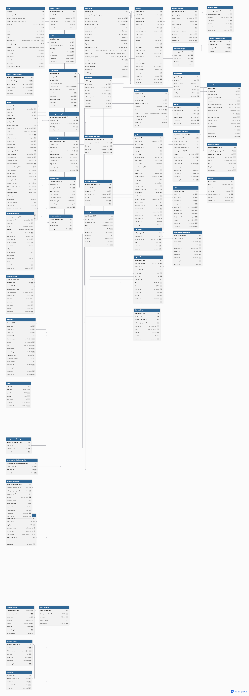

# StyleHub B2B

> 일반 상품 주문부터 샘플 주문, 소싱, 견적 협의, 계약과 이의제기까지 연결하는 국내 여성의류 B2B 거래 플랫폼입니다.

## Overview

셀러가 등록한 여성의류 상품을 바이어가 바로 구매하거나 샘플로 주문할 수 있고, 원하는 상품과 조건을 제시해 견적·계약을 거치는 소싱 거래도 지원하는 팀 프로젝트입니다.

단순 CRUD 구현보다 **거래 단계마다 어떤 데이터를 확정하고, 변경 이력을 어떻게 보존할지**에 초점을 두고 설계하고 있습니다.

## Project Status

현재 장바구니와 Checkout 연동을 바탕으로 판매 회사별 주문 생성 흐름을 구현하고 있으며, 견적·협의, 계약·전자서명과 이의제기 영역은 DB 구조 및 상태 흐름을 설계하고 있습니다. 아래 내용은 구현 중인 기능과 설계·검토 중인 기능을 구분해 기록합니다.

## Development Log

| 날짜                                                 | 작업                    | 키워드 | 관련 글                                   |
|----------------------------------------------------|-----------------------|---|----------------------------------------|
| [2026-06-12](<daily/2026-06-12 DB 설계.md>)          | B2B 거래 흐름과 DB 구조 설계   | DB, 아키텍처, 스냅샷 | [블로그](https://min-soon.tistory.com/83) |
| [2026-06-15](<daily/2026-06-15 스케줄러 사전 학습.md>)     | 주문 상태 자동화를 위한 스케줄러 검토 | Spring, Scheduled, 멱등성 | [블로그](https://min-soon.tistory.com/84) |
| [2026-06-16](<daily/2026-06-16 계약서 PDF 검토.md>)     | 계약서 PDF 생성과 무결성 검증 검토 | iText, PDF, SHA-256 | [블로그](https://min-soon.tistory.com/85) |
| [2026-06-17](<daily/2026-06-17 JPA 지연 로딩.md>)      | JPA 객체 연관관계와 지연 로딩 이해 | JPA, LAZY, 연관관계 | [블로그](https://min-soon.tistory.com/86) |
| [2026-06-18](<daily/2026-06-18 장바구니 연동.md>)        | 장바구니 API 연동           | DTO, Axios, 인증 | [블로그](https://min-soon.tistory.com/87) |
| [2026-06-19](<daily/2026-06-19 장바구니와 Checkout.md>) | 회사별 배송비 그룹화와 JPA N+1 문제 개선 | JPA, N+1, @EntityGraph, 배송비 | [블로그](https://min-soon.tistory.com/88) |
| [2026-06-20](<daily/2026-06-20 Checkout 흐름 정리.md>)  |  장바구니와 Checkout의 검증 책임 설계                 | Spring, CartItem, Checkout, 검증 책임 | [블로그](https://min-soon.tistory.com/90) |
| [2026-06-21](<daily/2026-06-21 주문 주체와 로컬 DB.md>) | B2B 주문 판매 주체 재설계와 로컬 DB 분리 | JPA, Company, Docker, MySQL | [블로그](https://min-soon.tistory.com/91) |
| [2026-06-22](<daily/2026-06-22 Hibernate 스키마 동기화.md>) | 주문 생성 연동과 Hibernate 스키마 동기화 오류 해결 | Hibernate, ddl-auto, 외래키, MySQL | [블로그](https://min-soon.tistory.com/92) |
| [2026-06-23](<daily/2026-06-23 ApiResponse 응답 구조.md>) | ApiResponse 적용 후 응답 처리 흐름 정리 | ApiResponse, Axios, Routing, 배송비 | [블로그](https://min-soon.tistory.com/93) |
| [2026-06-24](<daily/2026-06-24 Checkout DTO 분리.md>) | 장바구니 기반 Checkout과 주문 기반 Checkout 분리 | Checkout, DTO, CartItem, Order | [블로그](https://min-soon.tistory.com/94) |
| [2026-06-26](<daily/2026-06-26 Checkout 검증 응답 구조.md>) | Checkout 검증 실패 응답 구조와 Cart 사전 안내 책임 정리 | Checkout, Validation, DTO, UX | 작성 예정 |

프로젝트 진행에 따라 구현 내용과 설계 판단을 계속 추가하고 있습니다.

## Service Flow

| 거래 유형 | 주요 흐름 |
|---|---|
| **일반 주문** | 상품 선택 → 장바구니 → 결제 → 주문 확정 → 출고·배송 → 거래 완료 또는 취소·환불·이의제기 |
| **소싱 주문** | 소싱 요청 → 견적 제출 → 견적 협의·채택 → 계약서 검토·서명 → 결제 → 출고·배송 |

## Database Design

일반 구매와 샘플 주문, 소싱 요청부터 견적·계약까지 이어지는 B2B 거래 흐름을 기준으로 설계했습니다.

[DBML 원본 보기](database/schema.dbml)

## My Role

| 담당 영역 | 주요 내용 | 현재 단계 |
|---|---|---|
| **장바구니·주문** | 인증 사용자 기반 장바구니 추가·조회, 일반/샘플 주문 구분, 주문 데이터 스냅샷 | API와 화면 연동 중 |
| **견적·협의** | 최초 견적과 수정 견적의 버전 연결, 반복 협의 요청과 첨부파일 이력 관리 | DB 및 흐름 설계 |
| **계약·전자서명** | 수정 계약서 버전 관리, 서명 이력, PDF 생성과 SHA-256 무결성 검증 | 기술 검토 및 설계 |
| **이의제기·환불** | 주문 단위 문제 접수, 참여자별 응답 이력, 관리자 중재와 처리 결과 관리 | DB 및 상태 흐름 설계 |

## Key Design Decisions

### 주문 당시 정보를 스냅샷으로 보존

상품명, 옵션, 단가처럼 거래 이후 변경될 수 있는 값은 현재 상품 정보만 참조하지 않고 주문·견적·계약 당시의 값도 함께 저장하도록 설계했습니다.

### 수정본은 덮어쓰지 않고 새 버전으로 생성

견적서와 계약서는 수정될 때 기존 데이터를 변경하지 않고 새로운 행을 생성합니다. `parent_id`와 `version`으로 이전 문서와 연결해 어떤 조건에 합의하고 서명했는지 추적할 수 있도록 했습니다.

### 현재 상태와 처리 이력을 분리

주문, 협의, 이의제기 테이블에는 현재 상태를 두고 별도 이력 테이블에는 상태 변경과 참여자 응답을 시간순으로 저장해 조회 편의성과 추적 가능성을 함께 확보했습니다.

### 클라이언트보다 인증 정보와 DB 값을 신뢰

장바구니 요청에는 사용자가 직접 선택한 옵션, 수량, 주문 유형만 전달합니다. 사용자 ID는 `@LoginUser`에서 가져오고 상품명과 가격은 서버가 DB에서 다시 조회하도록 구성했습니다.

## Tech Stack

| 구분 | 기술 |
|---|---|
| **Backend** | Java 17, Spring Boot 3.5, Spring Data JPA |
| **Security** | Spring Security, JWT |
| **Database** | MySQL, Redis |
| **Frontend** | React, TypeScript, Vite, Axios, Zustand |
| **Build & Test** | Gradle, JUnit 5, Spring Security Test |

